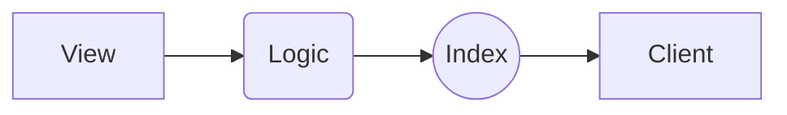

# React Project Boilerplate

Hey 👋

In this simple boilerplate, I want to present a way to structure your React project in a simple and
scalable way.

There are a lot of different strategies and approaches and most of them are perfectly suitable
depending on the project.
[It's basically the matter of the team mindset rather than enforcing some pattern without the need for](<[https://react-file-structure.surge.sh/](https://react-file-structure.surge.sh/)>).
On the other hand, it's always a good idea to think about some elements that can increase
productivity and development speed. In the following sections, I'll describe a bunch of different
ideas that can potentially help you build a really strong and robust project fundaments. In the
following document, I'll try to focus mainly on explaining the code and dependencies between
modules.

In the following sections I'll describe some reasons why, **in my opinion**, this boilerplate can
fit really well in many use cases.

# Structure

First things first, let's go through our file structure. It's a very simple example but if you don't
understand the nomenclature don't worry. I'll try to explain everything when we'll be going through
it.

```
React Project Structure
├── app
│   ├── components
│   │   └── Component
│   │       ├── index.tsx
│   │       └── index.scss
│   ├── redux
│   │   ├── ducks
│   │   │   ├── duck
│   │   │   │   ├── actions.ts
│   │   │   │   ├── index.ts
│   │   │   │   ├── reducers.ts
│   │   │   │   ├── saga.ts
│   │   │   │   └── types.ts
│   │   │   ├── index.ts
│   │   │   └── types.ts
│   │   └── index.ts
│   ├── screens
│   │   ├── Screen
│   │   │   ├── index.tsx
│   │   │   ├── logic.ts
│   │   │   ├── types.ts
│   │   │   └── view.tsx
│   │   └── index.ts
│   └── index.ts
└── index.ts
```

So we have the src folder in which we have the app folder and the index file which is, as you may
guess the entry file for our application.

# Screens

Firstly, let's talk about probably the most important part of our structure. Screens, as the name
suggests, are just separate subpages, modals (if you still use them), or other significant parts of
our project. It's really up to you to decide what is a significant part of the project. For now,
let's assume that they are just the subpages.

## View

This is a main view file of the screen section. This is a 'presentational' part of the screen. Here
we can just focus on the visual part, separating our mindset from the data management. We're
retrieving all necessary state and methods as properties and then, we can easily distribute and
assign them.

## Logic

The purpose of this file is to separate component business logic from the 'view' itself. Thanks to
following the 'Presentational and Container Components' pattern it's much easier to test and find
any potential business logic bugs without the need to looking through UI view. It's also a great
place to define hooks and functions. Thanks to this approach we can create a separate environment
for part of dev team responsible for managing the local state and communicating with the global
state.

## Index

This is an entry file to our screen. This file's main goal is to deliver the ready-to-use component
with all functionalities merged together. In this file, we're connecting the component to redux
store. It's also, at the same time, the last station of the screen structure pipeline. The overall
pipeline looks like this:



Yeah, I've added some different shapes to make it look more complex. But, at the end, it's just a
simple structure, well-known by most of the developers.

## Types/Styles

Additionally, we can create files for types or styles, depending on our needs.

# Components

Components that are part of our design system, that are used in multiple screens can be stored in
separate folder. In case of more complex components, the business logic can be also separated to
another file.

# State management

In almost every web app there is a time when you have to think about how to manage your state.

State is basically a living data of your application. The job of React is to put this data in UI and
transform this combination into DOM nodes. This concept is pretty straightforward but the fact is,
most of the problems with scaling a project comes from the wrong approach to choose the best
solution for a particular use case. All of the fancy performance optimalization are not that
important when you are not able to manage your state anymore.

Of course, it depends on the point of view.

From my perspective, the best and most suitable solution should be repeatable so every employee can
spend their creativity to solve more low-levels problems that are much more important for them than
the overall architecture.

## Ducks

That's why I decided to stick to one solution - the Ducks pattern. It sounds serious, isn't it? The
main idea is to group every piece of redux logic in a separate folder, named after a particular
feature.

(I know that the initial assumption of this pattern was to keep everything in a single file but I
modified it a little.)

Let's say, we want to create some logic that can handle all the authentication state. Instead of
creating action, reducers, types, etc. files and putting them in separate folders (let's say: action
folder, reducers folder, etc.) we can group them together.

This way is much more efficient in most cases than "jumping" from place to place.

Another, really cool idea is to keep all these files directly inside a particular screen folder,
let's say Auth. It sounds clever, but in most cases, this state needs to be shared across many
screens. That's why I decided to keep all ducks in a separate folder (redux/ducks).

## Saga

Handling side effects and asynchronous calls in a transparent way is crucial when we're dealing with
state management. We don't want to create a chaos in our code base. That's why in most of my
projects I'm using Redux Saga. It allows me, in a simple and ordered way, to handling communication
with the outer world.

It has some disadvantages though, it's really hard to configure Saga to handling real-time calls
(for example, through WebSockets).

## Redux vs MobX vs Hooks

In my opinion, immutable state trees are a more natural way to handle your data because of the way
that most frontend developers should think about the whole UI part. The DOM node is just the tree
structure. When you have the same pattern in your business logic (just like some kind of mirror
reflection) it is, in general much easier to manage and scale your application. On the other hand,
dependency graphs are for sure more flexible and create a broad way to use your creativity. The
truth is, nowadays most of the old use cases are coming towards limiting just to using hooks.

# Wrapping up

There are a lot of different useable tools like TypeScript, Husky, Prettier, Typedoc. All of them
can be used depending on your needs and your team workflow.
